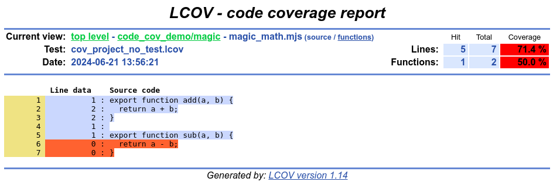

# Gleam Code Coverage Demo

An example project demonstrating code coverage for Gleam using the [Node.js](https://nodejs.org/en) test coverage reporter and [lcov](https://github.com/linux-test-project/lcov).

## Prerequisites

- A Node.js installation that supports `--experimental-test-coverage`
- `lcov` and `genhtml` (both from the [lcov](https://github.com/linux-test-project/lcov) package)
- [just](https://just.systems/) to run the build scripts (though you could port it to `make` or run the scripts manually)

## How to

_Note! Before doing anything, you may need to adjust `extract` and `remove` options in the `justfile` to better reflect your project structure._

First ensure all tests are passing (`just test_js` or `gleam test --target=javascript`).  Running the coverage report in the presence of failing tests does not give you good output to diagnose any problems.

Once the test suite is all green, run `just cov_js` to generate a coverage report.  If all goes well, the report will be located in `./_coverage/html/index.html`, ready to be opened in your favorite web browser.

## Example output

You will see that this project has some nesting and submodules and stuff, just to demonstrate that the filtering of the coverage output files works as expected.

Here is an example of what the reports look like:

As you can see, code coverage is shown for the generated JavaScript output rather than the Gleam source files, but it's still helpful.

## License

To the extent possible under law, Ryan M. Moore has waived all copyright and related or neighboring rights to this project.

_If for whatever reason, CC0 will not work for your project, you may use MIT or the Unlicense._
